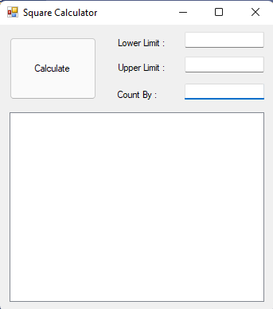
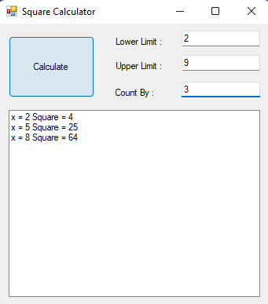
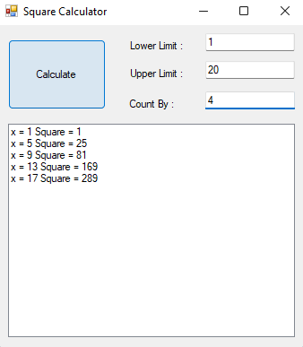

## Square Calculator (Mini Calculator)

Square Calculator is a mini calculator using C#. Need to enter the lower limit, upper limit and count by values. After enter the inputs client able to get square of the numbers in between lower and upper limit.

## Screen Shots
 
 
 